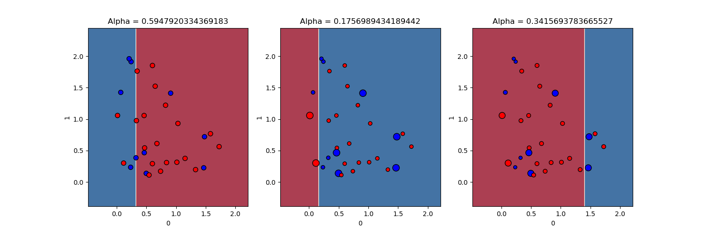
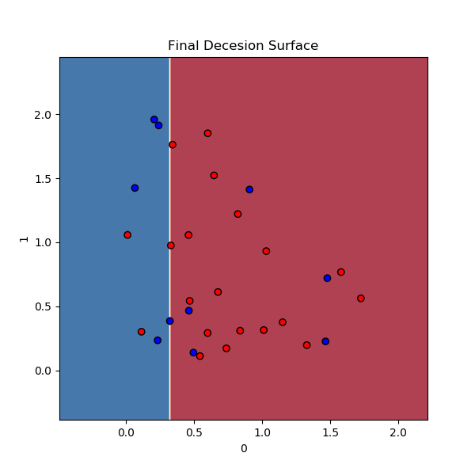
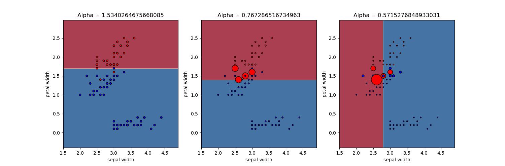
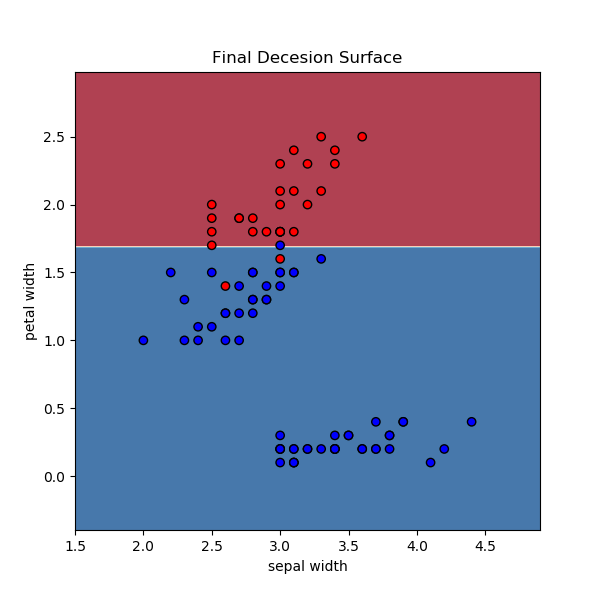

# ES654-2020 Assignment 2

Chandan Maji - 17110037

------
## 1(a)

## 1(b) Results of Iris Dataset
### Train Scores (60% of Dataset)
Accuracy:  95.56%  
Precision:  0.9384615384615385  
Recall:  1.0  
Precision:  1.0  
Recall:  0.8620689655172413  

### Test Scores (40% of Dataset)
Accuracy:  96.67%  
Precision:  1.0  
Recall:  0.9285714285714286  
Precision:  0.9411764705882353  
Recall:  1.0  

