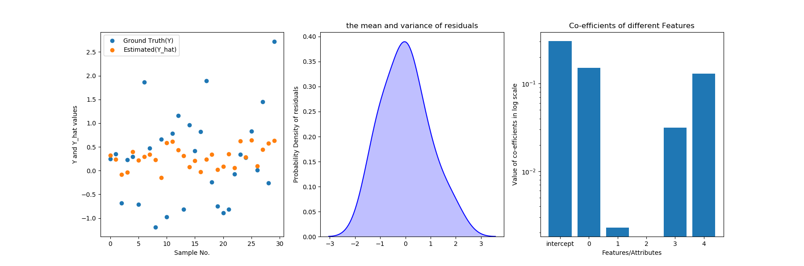
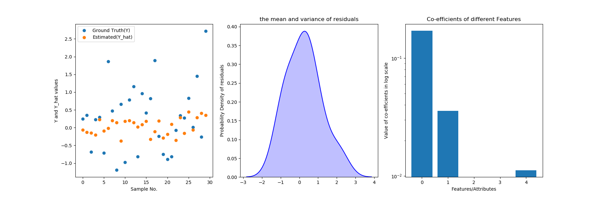
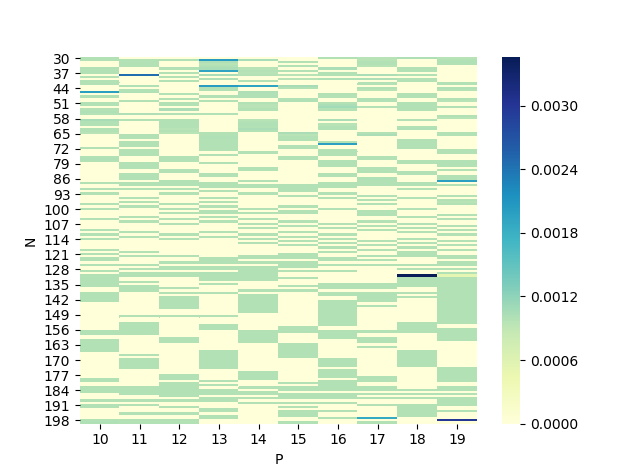
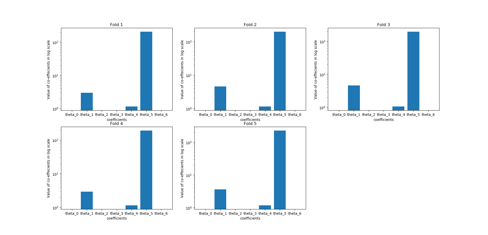
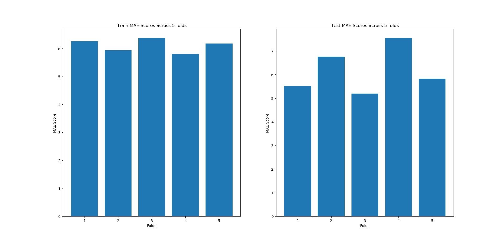

# ES654-2020 Assignment 2

Chandan Maji - 17110037

------

## 2(a)
RMSE:  0.9044265250464999  
MAE:  0.7114318433966357  
RMSE:  0.9452375875781541  
MAE:  0.7590075233630846  

## 2(b) Time Complexity

Theoritical time complexity of Normal Equation is O(P^3 + N*P^2), where P is the number of features and N is the number of samples.

## 2(c) Real Estate Dataset

